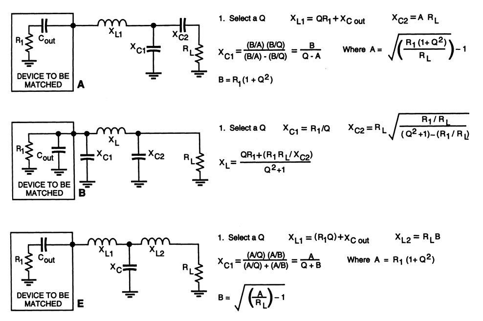

# Rfnetwork

## Introduction

Network.py is a simple utility for 
generating Spice netlist subcircuits 
which match the input impedance of
a source to the output impedance of 
a load.

The python utility supports 
three impedance matching circuits:

1. The LCC Match
2. The Pi Match
3. The Tee Match

The utility also performs a validation
of the subcircuit to ensure
the matching actually works.  If the validation
fails an error will be thrown.

## Walkthrough

To generate a netlist to match a source impedance of 
10+10j ohms at 7 Mhz to a load of 50 ohms with a Q of 3 using a LCC network run:


```
$ python3 network.py --name lcc_output --source 10+10j -q 3 --frequency 7e6 --lcc
* Fd  = 7 MHz
* BW  = 2.33333 MHz
* Q   = 3
* RL  = 50
* ZG  = 10+10j
* Zin = 10-10j

.subckt lcc_output 1 3
L1 1 2 454.728nH
C2 2 0 454.728pF
C3 2 3 454.728pF
.ends
```


To generate a Tee network instead use:


```
$ python3 network.py --name tee_output --source 10+10j -q 3 --frequency 7e6 --tee
* Fd  = 7 MHz
* BW  = 2.33333 MHz
* Q   = 3
* RL  = 50
* ZG  = 10+10j
* Zin = 10-10j

.subckt tee_output 1 3
L1 1 2 454.728nH
C2 2 0 909.457pF
L3 2 3 1136.82nH
.ends
```


Since a Pi network is impractical for small load source impedances, let's
assume the source impedance is 1000-100j.
In addition because an error gets thrown for a Q of 3, change Q to 5 instead.


```
$ python3 network.py --name pi_output --source 1000-100j -q 5 --frequency 7e6 --pi
* Fd  = 7 MHz
* BW  = 1.4 MHz
* Q   = 5
* RL  = 50
* ZG  = 1000-100j
* Zin = 1000+100j

.subckt pi_output 1 2
C1 1 0 110.305pF
L2 1 2 4889.38nH
C3 2 0 243.663pF
.ends
```


If you want to reverse the network, say to match the input of an amplifier, use the
--reverse option.


```
$ python3 network.py --name pi_input -r --source 1000-100j -q 5 --frequency 7e6 --pi
* Fd  = 7 MHz
* BW  = 1.4 MHz
* Q   = 5
* RL  = 50
* ZG  = 1000-100j
* Zin = 1000+100j

.subckt pi_input 1 2
C1 1 0 243.663pF
L2 1 2 4889.38nH
C3 2 0 110.305pF
.ends
```


## How to Install

Perform a pip install of the required python libraries using:


```
$ pip install -r requirements.txt
Requirement already satisfied: numpy in /usr/lib/python3/dist-packages (from -r requirements.txt (line 1)) (1.19.5)
```


## Command Line Usage

The utility's command line usage is as follows:


```
$ python3 network.py --help
usage: network.py [-h] [-n NAME] [-s SOURCE] [-l LINE] [-q QUALITY]
                  [-f FREQUENCY] [-b BANDWIDTH] [-r] [--lcc] [--tee] [--pi]

optional arguments:
  -h, --help            show this help message and exit
  -n NAME, --name NAME  subcircuit name (default: network)
  -s SOURCE, --source SOURCE
                        source impedance (default: None)
  -l LINE, --line LINE  load impedance or Zo (default: 50)
  -q QUALITY, --quality QUALITY
                        q factor (default: 1)
  -f FREQUENCY, --frequency FREQUENCY
                        frequency (default: None)
  -b BANDWIDTH, --bandwidth BANDWIDTH
                        bandwidth (default: None)
  -r, --reverse         reverse (default: False)
  --lcc                 use a LCC network (default: False)
  --tee                 use a TEE network (default: False)
  --pi                  use a PI network (default: False)
```


## The Matching Networks

See the image before for the impedance matching
networks supported:




